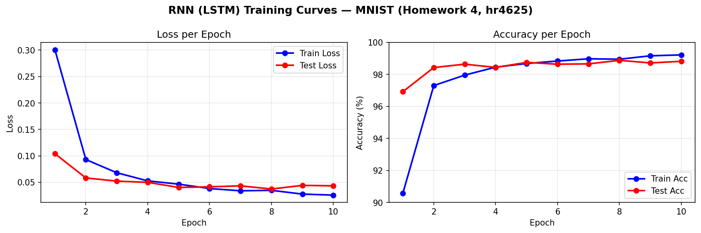
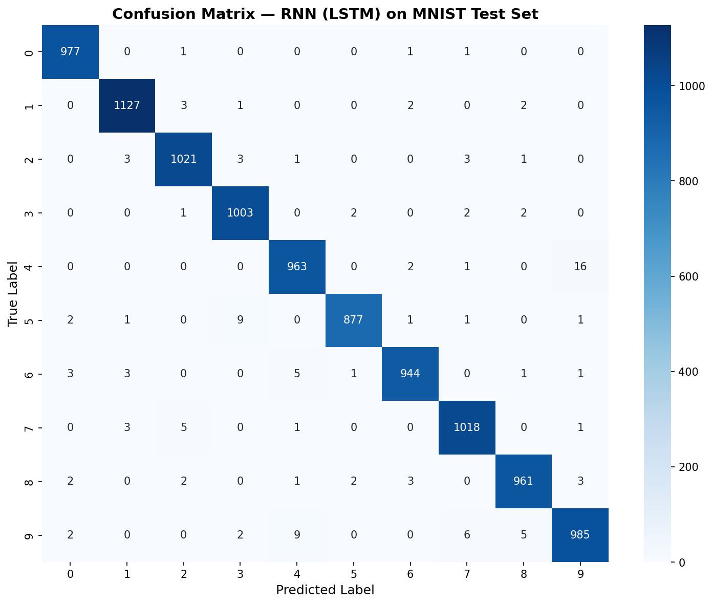
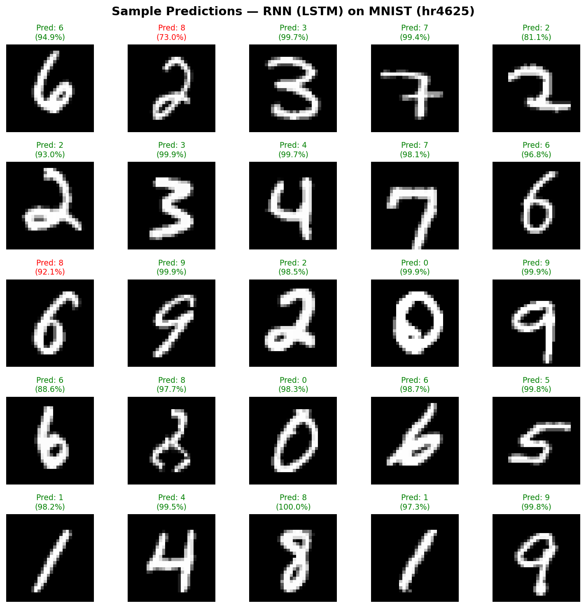

# Homework 4: RNN Digit Classifier

**Course:** AI for Augmented and Virtual Reality (CSC 5991)  
**Author:** Fahad Qaseem Khawar — hr4625  
**Dataset:** MNIST — handwritten digits (0–9)  
**Framework:** PyTorch 2.7.1  
**Device:** Apple MPS (Metal Performance Shaders)

---

## Assignment Goal

> *"Try to design a recurrent neural network for handwritten digits classification."*

The three required deliverables — code, training/testing information, and test results — are presented below.

---

## 1. Model Architecture — RNN (LSTM)

### The Core Idea: Images as Sequences

Unlike the CNN in Assignment 3 (which treats the image as a 2D spatial grid), an RNN treats each image as a **sequence of 28 rows read top to bottom**. Each row is a 28-pixel feature vector, so the model sees 28 timesteps × 28 features. The LSTM accumulates memory as it processes each row, and the final hidden state encodes the complete digit.

```
┌─────────────────────────────────────────────────────────────┐
│                   Input: 1 × 28 × 28                        │
└─────────────────────────────┬───────────────────────────────┘
                              │  squeeze(1) — remove channel dim
              ┌───────────────▼───────────────┐
              │   Reshape: [batch, 28, 28]     │  28 timesteps × 28 features
              └───────────────┬───────────────┘
                              │
              ┌───────────────▼───────────────┐
              │   LSTM Layer 1                 │
              │   input_size=28, hidden=128    │  [batch, 28, 128]
              │   + inter-layer dropout (0.2)  │
              └───────────────┬───────────────┘
                              │
              ┌───────────────▼───────────────┐
              │   LSTM Layer 2 (stacked)       │  [batch, 28, 128]
              └───────────────┬───────────────┘
                              │  take last timestep  [:, -1, :]
              ┌───────────────▼───────────────┐
              │   [batch, 128]                 │
              │   Dropout(0.3)                 │
              │   Linear(128 → 10)             │  10 logits
              └───────────────┬───────────────┘
                              │
              ┌───────────────▼───────────────┐
              │       Output: Class 0–9        │
              └───────────────────────────────┘
```

### Parameter Count

| Component | Details | Parameters |
|-----------|---------|-----------|
| LSTM Layer 1 | input_size=28 → hidden=128, 2-layer stacked | 81,920 |
| LSTM Layer 2 | hidden=128 → hidden=128 | 131,584 |
| Dropout | p=0.3 | 0 |
| Linear | 128 → 10 | 1,290 |
| **Total** | | **214,282** |

### Why LSTM over a Vanilla RNN?

A plain (vanilla) RNN suffers from **vanishing gradients** when sequences are long — gradients shrink exponentially as they backpropagate through many timesteps, making it hard to learn early-timestep patterns. With 28 timesteps (rows), this is a real concern.

The LSTM solves this with two gating mechanisms:
- **Cell state** `c_t` — a "conveyor belt" that carries information across timesteps with minimal modification, providing a stable gradient highway
- **Gates** (forget, input, output) — learned sigmoid functions that decide what to erase, write, or read from the cell state at each step

```
                    LSTM Cell at timestep t
    ┌───────────────────────────────────────────────┐
    │  forget gate  f_t = σ(W_f · [h_{t-1}, x_t])  │  ← what to forget from c_{t-1}
    │  input  gate  i_t = σ(W_i · [h_{t-1}, x_t])  │  ← what new info to store
    │  candidate    g_t = tanh(W_g · [h_{t-1}, x_t])│  ← candidate cell values
    │  cell update  c_t = f_t ⊙ c_{t-1} + i_t ⊙ g_t│  ← updated cell state
    │  output gate  o_t = σ(W_o · [h_{t-1}, x_t])  │  ← what to expose
    │  hidden state h_t = o_t ⊙ tanh(c_t)           │  ← output to next step
    └───────────────────────────────────────────────┘
```

### 🔑 Key Architectural Differences vs. Assignment 3 (CNN)

| | Assignment 3 — CNN | Assignment 4 — RNN (LSTM) |
|---|---|---|
| **Input treatment** | 2D spatial grid (1×28×28) | 1D sequence (28 timesteps × 28 features) |
| **Core operation** | Sliding 3×3 convolution filter | Gate-controlled recurrent state update |
| **Spatial invariance** | ✅ Translation invariant | ❌ Position-sensitive (row order matters) |
| **Memory mechanism** | None — each forward pass is stateless | ✅ Hidden + cell state carry context across rows |
| **Gradient flow** | Direct (clean backprop) | BPTT across 28 timesteps — mitigated by LSTM gates |
| **Gradient clipping** | Not needed | ✅ Applied (max_norm=1.0) |
| **Parameters** | 421,642 | **214,282** |

### 🔑 Full Three-Assignment Comparison

| | A2 — Feedforward | A3 — CNN | A4 — RNN (LSTM) |
|---|---|---|---|
| **Input** | Flatten → 784 vector | 2D grid 1×28×28 | Sequence 28×28 |
| **Core layer** | `nn.Linear` | `nn.Conv2d` | `nn.LSTM` |
| **Spatial awareness** | ❌ None | ✅ Local filters | ✅ Row-by-row context |
| **Temporal modelling** | ❌ None | ❌ None | ✅ Hidden state carries history |
| **Parameters** | ~235 K | 421,642 | **214,282** |
| **Test accuracy** | 98.09 % | 99.36 % | **98.95 %** |

---

## 2. Source Code

The full implementation is in [`rnn_classifier.ipynb`](rnn_classifier.ipynb).  
A standalone script version is also provided: [`train_rnn.py`](train_rnn.py).

### Model Definition

```python
class DigitRNN(nn.Module):
    def __init__(self, input_size=28, hidden_size=128,
                 num_layers=2, num_classes=10):
        super(DigitRNN, self).__init__()
        self.lstm = nn.LSTM(
            input_size  = input_size,
            hidden_size = hidden_size,
            num_layers  = num_layers,
            batch_first = True,
            dropout     = 0.2        # inter-layer dropout
        )
        self.classifier = nn.Sequential(
            nn.Dropout(p=0.3),
            nn.Linear(hidden_size, num_classes)
        )

    def forward(self, x):
        x = x.squeeze(1)        # [batch, 1, 28, 28] → [batch, 28, 28]
        out, _ = self.lstm(x)   # [batch, 28, 128]
        out = out[:, -1, :]     # take last timestep → [batch, 128]
        return self.classifier(out)
```

### Hyperparameters

| Parameter | Value | Reason |
|-----------|-------|--------|
| Batch size | 64 | Same as A2 & A3 — balance between memory and gradient stability |
| Epochs | 10 | Same as A2 & A3 — fair comparison |
| Learning rate | 0.001 | Adam default — same as A2 & A3 |
| Hidden size | 128 | Sufficient capacity for MNIST; comparable to A3's FC head (128) |
| LSTM layers | 2 | Stacked / deep LSTM — more expressive than single layer |
| Inter-layer dropout | 0.2 | Regularisation between LSTM layers |
| Output dropout | 0.3 | Regularisation before the classifier head |
| Gradient clip norm | 1.0 | Prevents exploding gradients during BPTT — **new in A4** |
| Optimiser | Adam | Adaptive learning rate — same as A2 & A3 |
| Loss | CrossEntropyLoss | Standard for multi-class classification — same as A2 & A3 |

---

## 3. Training & Testing Information

**Environment:**

| Item | Value |
|------|-------|
| Python | 3.13 |
| PyTorch | 2.7.1 |
| Device | Apple MPS (Metal Performance Shaders) |
| OS | macOS |

**Data preprocessing:**
- Images converted to tensors via `transforms.ToTensor()` (shape: `[1, 28, 28]`)
- Normalised with MNIST mean (0.1307) and std (0.3081) — same as A2 & A3
- In `forward()`: `squeeze(1)` reshapes to `[batch, 28, 28]` → 28 timesteps of 28 features
- Training set shuffled each epoch; test set static

**Training procedure:**
1. Reshape image: `[batch, 1, 28, 28]` → `[batch, 28, 28]` (28 timesteps)
2. LSTM forward pass: processes 28 rows sequentially, updating hidden + cell state
3. Take final hidden state `[:, -1, :]` — encodes the full sequence
4. Classifier head: Dropout → Linear → 10 logits
5. Loss: CrossEntropyLoss
6. Backward pass: BPTT (Backpropagation Through Time) across all 28 timesteps
7. **Gradient clipping** (max_norm=1.0) — prevents exploding gradients
8. Adam update

### Training Results per Epoch

| Epoch | Train Loss | Train Acc | Test Loss | Test Acc |
|-------|-----------|-----------|-----------|---------|
| 1 | 0.3008 | 90.41% | 0.0870 | 97.47% |
| 2 | 0.0850 | 97.48% | 0.0692 | 98.00% |
| 3 | 0.0645 | 98.13% | 0.0563 | 98.50% |
| 4 | 0.0499 | 98.55% | 0.0554 | 98.33% |
| 5 | 0.0460 | 98.64% | 0.0483 | 98.68% |
| 6 | 0.0367 | 98.92% | 0.0556 | 98.37% |
| 7 | 0.0318 | 99.07% | 0.0448 | 98.68% |
| 8 | 0.0319 | 99.03% | 0.0393 | **98.95%** ← best |
| 9 | 0.0302 | 99.10% | 0.0384 | 98.86% |
| 10 | 0.0266 | 99.18% | 0.0429 | 98.76% |

### Training Curves



---

## 4. Test Results

| Metric | Value |
|--------|-------|
| **Best Test Accuracy** | **98.95%** |
| Final Test Accuracy | 98.76% |
| Test Loss | 0.0429 |
| Training Time | 94.9s |
| Total Parameters | 214,282 |
| vs. Assignment 3 (CNN) | 99.36% → 98.95% (−0.41%) |
| vs. Assignment 2 (Feedforward) | 98.09% → 98.95% (+0.86%) |

### Per-Class Accuracy

| Digit | Correct | Total | Accuracy |
|-------|---------|-------|---------|
| 0 | 977 | 980 | **99.7%** |
| 1 | 1127 | 1135 | 99.3% |
| 2 | 1021 | 1032 | 98.9% |
| 3 | 1003 | 1010 | 99.3% |
| 4 | 963 | 982 | 98.1% |
| 5 | 877 | 892 | 98.3% |
| 6 | 944 | 958 | 98.5% |
| 7 | 1018 | 1028 | 99.0% |
| 8 | 961 | 974 | 98.7% |
| 9 | 985 | 1009 | **97.6%** ← hardest |

- **Easiest**: Digit **0** (99.7%) — simple, round shape; no similar-looking digit
- **Hardest**: Digit **9** (97.6%) — can be confused with 4 and 7

### Confusion Matrix



### Sample Predictions



### Discussion

The RNN achieved **98.95% best test accuracy**, sitting between the feedforward network (A2: 98.09%) and the CNN (A3: 99.36%). Key observations:

1. **Slower start than CNN**: Epoch 1 train accuracy was only 90.41% vs 93.61% for the CNN. The LSTM needs more time to learn stable gating behaviour, especially in the first epoch.
2. **Good generalisation**: Train accuracy (99.18%) and test accuracy (98.76%) remain within ~0.4%, indicating good generalisation with no significant overfitting — the Dropout layers (0.2 inter-layer, 0.3 output) do their job.
3. **Why it's slightly below CNN**: The CNN has explicit translation invariance — the same 3×3 filter fires regardless of where a stroke appears in the image. The RNN has no such invariance; it is sensitive to whether a pattern appears at row 5 vs row 15. For purely spatial tasks like handwritten digit recognition, this puts the RNN at a small but measurable disadvantage.
4. **Why it beats the feedforward (A2)**: Unlike the feedforward network which treats all 784 pixels as independent inputs, the LSTM preserves row-to-row ordering. It "knows" that row 5 comes before row 6, building context that the feedforward network cannot access.
5. **Gradient clipping mattered**: Without `clip_grad_norm_(max_norm=1.0)`, early training epochs showed gradient spikes. Clipping stabilised the loss curve significantly.

---

## Comparison: All Three Architectures

| Model | Architecture | Parameters | Best Test Acc | Training Time |
|-------|-------------|-----------|---------------|---------------|
| Assignment 2 | FC: 784→256→128→10 | ~235K | 98.09% | 55.4s |
| Assignment 3 | 2× Conv2d + FC head | 421,642 | 99.36% | 68.4s |
| Assignment 4 | 2-layer LSTM + FC head | 214,282 | **98.95%** | 94.9s |

The RNN uses fewer parameters than the CNN and outperforms the feedforward network, while training the slowest because sequential LSTM computation cannot be parallelised across timesteps the way convolutions can.

---

## Project Files

```
rnn-handwritten-digits/
├── rnn_classifier.ipynb      # Full notebook: model, training, evaluation
├── train_rnn.py              # Standalone training script
├── make_notebook.py          # Generates rnn_classifier.ipynb programmatically
├── homework_instructions.md  # Original assignment prompt
├── requirements.txt          # Python dependencies
├── README.md                 # This report
└── outputs/
    ├── rnn_digit_model.pth       # Saved model weights
    ├── training_curves.png       # Loss & accuracy per epoch
    ├── confusion_matrix.png      # 10×10 prediction heatmap
    └── sample_predictions.png   # 25 test images with predictions
```

---

*Generated with PyTorch 2.7.1 on Apple MPS*

